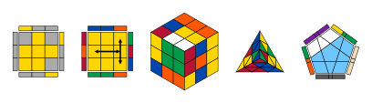

# cubst
<div align="center">Version 0.1.0</div>

Draw Rubik's cubes in Typst. `cubst` builds a cube *state* from an algorithm and
renders it as an OLL/PLL diagram, any face seen straight on, an F2L or full 3D
view, or an unfolded net.
Any N×N cube is supported; the renderers are tested on 2×2 to 5×5.

<picture>
  <source media="(prefers-color-scheme: dark)" srcset="./thumbnail-dark.svg">
  
</picture>

## Getting started

```typ
#import "@preview/cubst:0.1.0": *

// the case an algorithm solves, drawn as an OLL diagram
#draw(case("R U R' U R U2 R'"), view: "oll")

// a PLL diagram with arrows between (row, col) positions on the top face
#draw(case("R U R' U' R' F R2 U' R' U' R U R' F'"), view: "pll", arrows: (
  (from: (0, 2), to: (2, 2), double: true),
  (from: (1, 0), to: (1, 2), double: true),
))

// an F2L case (last-layer pieces greyed out) and a scrambled cube in 3D
#draw(case("U R U' R'"), view: "f2l")
#draw(cube(scramble: "R U F2 D' L B'"), view: "full")
```

## How it works

States are plain values, so you can build them once and draw them many ways:

```typ
#let c = cube(scramble: "R U F2 D' L B'")
#draw(c, view: "full")
#draw(apply(c, "y2"), view: "full")   // look at the other side
#draw(c, view: "net")
```

| Function | Purpose |
| --- | --- |
| `cube(size: 3, scramble: none, inverted: false, scheme: ..)` | build a cube, optionally scrambled |
| `case(alg)` | the state that `alg` solves (inverse scramble) |
| `apply(c, alg)` | apply more moves, returns a new state |
| `keep-colors`, `hide-faces`, `hide-pieces`, `mask` | hide stickers before drawing |
| `draw(c, view: .., mask: auto, ..options)` | render; views: `oll`, `pll`, `face` (with `face: "F"` etc.), `f2l`, `full`, `net` |

Notation: `R U F' D2`, wide `Rw r 3Rw`, slices `M E S`, rotations `x y z`,
groups `(R U R' U')3`.

The default scheme is yellow on top, green in front. See `docs/manual.pdf` for all options.

## Development

Requirements: [Typst](https://typst.app) ≥ 0.13.1, [just](https://github.com/casey/just),
and [Tytanic](https://github.com/typst-community/tytanic) (`brew install tytanic`).

```sh
just test          # run the test suite
just update        # accept new reference images
just doc           # build docs/manual.pdf and the thumbnails
just install       # install to the @local namespace for use in other documents
just uninstall
```

Layout:

- `src/lib.typ` public API (re-exports only)
- `src/deps.typ` the single place third-party packages (CeTZ) are imported
- `src/state.typ` cube state, accessors and masks
- `src/moves.typ` notation parser and move engine
- `src/cube.typ` the `cube`/`case` constructors
- `src/draw/` renderers (`2d.typ`, `net.typ`, `3d.typ`) and the `draw` dispatcher (`views.typ`)
- `tests/` Tytanic unit and image-regression tests
- `examples/` scratch documents, not published
- `docs/` manual and thumbnail sources

## License

[Unlicense](LICENSE)
